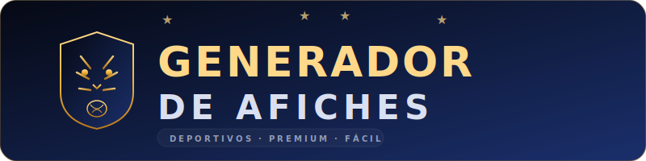

<div align="center">
  
  
  <br/><br/>

  <p>
    <strong>Creá afiches deportivos profesionales en segundos.</strong><br/>
    Sin frameworks · Sin servidor · Abrí un HTML y listo.
  </p>

  <p>
    
    
    
    
  </p>
</div>

---

## ✨ ¿Qué es?

Una app web ultra simple que genera **afiches de partidos de fútbol** con diseño premium (estilo nocturno, glassmorphism, glow dorado). Pensada para que **cualquier persona** — incluso sin experiencia en tecnología — pueda crear y descargar afiches en calidad HD.

### Características

| Función | Detalle |
|---------|---------|
| 🎨 **Preview en vivo** | Cada cambio se refleja al instante en el afiche |
| 📝 **Todo editable** | Torneo, título, fecha, hora, cancha, equipos, logos |
| 🖼️ **Fondos** | 4 incluidos + subir imagen propia |
| 🌙 **3 Temas** | Nocturno Dorado · Rojo Intenso · Azul Limpio |
| 🎯 **Color picker** | Elegí cualquier color accent |
| 🔤 **3 Tipografías** | Bebas+Montserrat · Bebas+Inter · Oswald+Montserrat |
| 📸 **Exportar JPG** | Calidad 2x, 3x o 4x — descarga instantánea |
| 💾 **Guarda automáticamente** | localStorage recuerda tu último afiche |
| 📱 **Responsive** | Funciona en desktop y mobile |
| ⚡ **Acciones rápidas** | Plantilla, nuevo partido, duplicar, reset |

---

## 🚀 Cómo usar

### 1. Abrir

```
Opción A → Doble clic en index.html
Opción B → Live Server en VS Code (recomendado)
```

> **Tip**: Si la descarga de JPG falla con `file://`, usá Live Server o Firefox.

### 2. Editar

1. Completá los campos del panel izquierdo (textos, equipos, logos)
2. Elegí fondo, tema y tipografía
3. Mirá el preview actualizarse en tiempo real

### 3. Guardar

Apretá el botón dorado **📸 GUARDAR FOTO** y se descarga el JPG automáticamente.

---

## 📂 Estructura del proyecto

```
GeneradorAfiches/
├── index.html               ← App principal (abrir en navegador)
├── styles.css               ← Estilos completos (panel + poster + responsive)
├── app.js                   ← Lógica: estado, bindings, export, localStorage
├── logo.svg                 ← Logo del proyecto (SVG)
├── embed_assets.py          ← Genera el HTML standalone
├── Foto1.png                ← Logo equipo A (default: Tigre)
├── Foto2.png                ← Logo equipo B (default: Ferro)
├── FutbolBackground3.png    ← Fondo principal
├── FutbolBackground1.png    ← Fondo alternativo
├── FutbolBackground2.png    ← Fondo alternativo
├── FutbolBackground2.jpg    ← Fondo alternativo (comprimido)
├── Partido_Recopa_2026.jpg  ← Fondo alternativo
├── .gitignore
└── README.md
```

---

## 🖥️ Screenshots

<table>
  <tr>
    <td align="center"><strong>Panel + Preview (Desktop)</strong></td>
  </tr>
  <tr>
    <td>
      Panel de controles a la izquierda · Afiche premium a la derecha<br/>
      Todo editable en tiempo real · Botón GUARDAR FOTO siempre visible
    </td>
  </tr>
</table>

---

## 🔧 Standalone (HTML autocontenido)

Para generar un HTML con **todas las imágenes embedidas** (para enviar por mail o subir a cualquier hosting):

```bash
python embed_assets.py
```

Genera `match_poster_standalone.html` (~17 MB) con:
- CSS embedido
- Imágenes en base64
- Botón de descarga JPG incluido
- Funciona offline (excepto Google Fonts)

> ⚠️ Las imágenes subidas desde el navegador no se embeden. Solo los assets default del proyecto.

---

## 🛠️ Tecnologías

- **HTML5 + CSS3 + JavaScript** vanilla (sin frameworks)
- **html2canvas** para exportar el poster a JPG
- **Google Fonts** (Bebas Neue, Montserrat, Inter, Oswald)
- **Python 3** para el generador de standalone
- **localStorage** para persistencia

---

## 🎨 Personalizar para tu liga/equipo

La app es **completamente genérica** — no está acoplada a ningún equipo. Para personalizar los defaults:

1. Abrí `app.js`
2. Modificá el objeto `DEFAULT_STATE` con tus datos
3. Para agregar fondos: poné la imagen en la carpeta y agregala al array `BACKGROUNDS`
4. Para agregar temas de color: agregá un objeto en `THEMES`

---

## ❓ Troubleshooting

| Problema | Solución |
|----------|----------|
| "No se pudo exportar" al guardar | Usá **Live Server** en vez de `file://`, o abrí en **Firefox** |
| Las imágenes no se ven | Verificá que los `.png` estén en la misma carpeta que `index.html` |
| La descarga no inicia | Desactivá el bloqueador de popups |
| Los cambios no se guardan | Modo incógnito no guarda localStorage. Imágenes muy pesadas pueden llenar el storage |

---

## 📄 Licencia

Uso libre. Hacé los afiches que quieras. ⚽

---

<div align="center">
  <sub>Hecho con ❤️ para que cualquiera pueda crear afiches profesionales.</sub>
</div>
